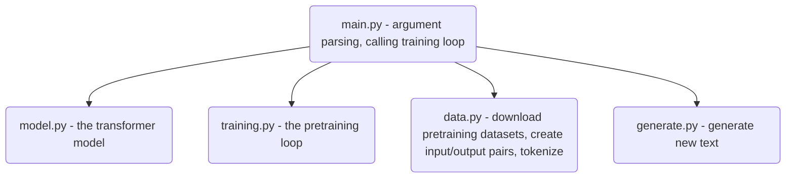

# Pretraining transformers from scratch

## Architecture


```mermaid
flowchart TD
main(main.py - argument parsing, calling training loop)
model(model.py - the transformer model)
training(training.py - the pretraining loop)
data(data.py - download pretraining datasets, create input/output pairs, tokenize)
generate(generate.py - generate new text)

main --> model
main --> training
main --> data
main --> generate
```

## Check before committing

```bash
uvx ty check && uvx ruff check && uv run pytest
```